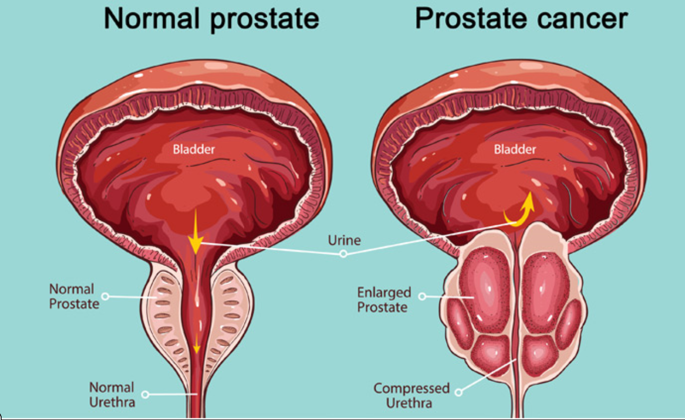

# Asistent Automat pentru un student la medicina  

## Obiective
Dezvoltarea unui sistem de asistenta medicala pentru identificarea cancerului de prostata

## Ideea de baza
Cancerul de prostată (CP) este cea de-a treia cauză de deces în rândul bărbaţilor, după cancerul pulmonar şi cel colorectal.
Alegerea tratamentului adecvat depinde de mai mulţi factori printre care stadiul bolii, potențialele afecțiuni asociate, vârsta pacientului, eventualele opțiuni terapeutice anterioare şi nu în ultimul rând preferinţele pacientului.  
Monitorizarea si identificarea celulelor canceroase este foarte importanta.

## TO DO List
1. Dezvoltare flow principal pentru aplicatie 
- Incarcare si vizualizare imagine medicala (variate modalitati medicale – de ex. RMN, CT, imagini 2D sau 3D)
2. Dezvoltare componenta inteligenta
- Antrenarea si validarea unui model (sau a 2 modele) de identificare automata a defectelor (semnalate prin conturul si prin textura regiunii respective)
- Testarea modelului/modelelor pe imagini noi - integrarea modelului (clasificatorului) in aplicatie
3. Imbunatatire componenta inteligenta
- Din perspectiva calitatii procesului de invatare automata
- Din perspectiva complexitatii temporale si spatiale aferenta clasificatorului
- Din perspectiva clientului (utilizarii aplicatiei de catre student/medic)

## Date si referinte
**Imagini**
Imagini - prostata
1. https://wiki.cancerimagingarchive.net/display/Public/PROSTATE-MRI
2. https://prostatemrimagedatabase.com/
3. see datasets from section "Imagind data" of this [article](http://tau.amegroups.com/article/view/24493/23261)
4. see prostate datasets from https://www.cancerimagingarchive.net/collections/

**Evaluare**
1. VISCERAL tool http://www.visceral.eu/resources/evaluatesegmentation-software/
2. Descriere metrici https://bmcmedimaging.biomedcentral.com/articles/10.1186/s12880-015-0068-x

**Metode de lucru**
1. Vezhnevets, Vladimir, and Vadim Konouchine. "GrowCut: Interactive multi-label ND image segmentation by cellular automata." proc. of Graphicon. Vol. 1. No. 4. 2005.
2. Kauffmann, Claude, and Nicolas Piché. "Seeded ND medical image segmentation by cellular automaton on GPU." International journal of computer assisted radiology and surgery 5.3 (2010): 251-262.
3. Wildeboer, R. R., van Sloun, R. J., Wijkstra, H., & Mischi, M. (2020). Artificial intelligence in multiparametric prostate cancer imaging with focus on deep-learning methods. Computer Methods and Programs in Biomedicine, 189, 105316. [link](https://reader.elsevier.com/reader/sd/pii/S0169260719310442?token=2D40484780B1B45D0D904AD76502DA6841EE3E1DFFA53FB9CC4B1F25666391AEA7732747F8D5DDDCC825094F2D8EB888)
4. Abbasi, A. A., Hussain, L., Awan, I. A., Abbasi, I., Majid, A., Nadeem, M. S. A., & Chaudhary, Q. A. (2020). Detecting prostate cancer using deep learning convolution neural network with transfer learning approach. Cognitive Neurodynamics, 1-11. [link](https://link.springer.com/article/10.1007/s11571-020-09587-5#Sec2)
5. Andras, I., Crisan, D., Cata, E., Tamas-Szora, A., Caraiani, C., Coman, R. T., ... & Crisan, N. (2019). MRI-TRUS fusion guided prostate biopsy–initial experience and assessment of the role of contralateral lobe systematic biopsy. Medical ultrasonography, 21(1), 37-44. [link](https://medultrason.ro/medultrason/index.php/medultrason/article/view/1705/1290)
6. Zhu, C. Z., Ting, H. N., Ng, K. H., & Ong, T. A. (2019). A review on the accuracy of bladder cancer detection methods. Journal of Cancer, 10(17), 4038. [link](https://www.ncbi.nlm.nih.gov/pmc/articles/PMC6692607/pdf/jcav10p4038.pdf)
7. Lovegrove, C. E., Matanhelia, M., Randeva, J., Eldred-Evans, D., Tam, H., Miah, S., ... & Shah, T. T. (2018). Prostate imaging features that indicate benign or malignant pathology on biopsy. Translational andrology and urology, 7(Suppl 4), S420. [link](https://www.ncbi.nlm.nih.gov/pmc/articles/PMC6178322/pdf/tau-07-S4-S420.pdf)
8. Andras, I., Mazzone, E., van Leeuwen, F. W., De Naeyer, G., van Oosterom, M. N., Beato, S., ... & Crisan, N. (2019). Artificial intelligence and robotics: a combination that is changing the operating room. World journal of urology, 1-8. [link](https://idp.springer.com/authorize/casa?redirect_uri=https://link.springer.com/content/pdf/10.1007/s00345-019-03037-6.pdf&casa_token=-c9oeyzp5f0AAAAA:tnkHHXthKDC3fbS3Uhuh9gSMpLbkJmo_r7JX8hIfSpzpY0kanL7JdB7shbaQqs3cMtQDNSGc0yYAbFBVyA)
9. Schelb, P., Kohl, S., Radtke, J. P., Wiesenfarth, M., Kickingereder, P., Bickelhaupt, S., ... & Maier-Hein, K. H. (2019). Classification of cancer at prostate MRI: deep learning versus clinical PI-RADS assessment. Radiology, 293(3), 607-617. [link](https://pubs.rsna.org/doi/10.1148/radiol.2019190938)
10. Cuocolo, R., Cipullo, M. B., Stanzione, A., Ugga, L., Romeo, V., Radice, L., ... & Imbriaco, M. (2019). Machine learning applications in prostate cancer magnetic resonance imaging. European radiology experimental, 3(1), 1-8. [link](https://www.ncbi.nlm.nih.gov/pmc/articles/PMC6686027/pdf/41747_2019_Article_109.pdf)
11. Willemink, M. J., Koszek, W. A., Hardell, C., Wu, J., Fleischmann, D., Harvey, H., ... & Lungren, M. P. (2020). Preparing medical imaging data for machine learning. Radiology, 295(1), 4-15.[link](https://www.ncbi.nlm.nih.gov/pmc/articles/PMC7104701/)
12. Andrey Fedorov, Multiparametric MRI in Prostate Cancer: Open source tools for quantitative analysis and data standardization [link](http://amos3.aapm.org/abstracts/pdf/137-41561-452581-142232-851680087.pdf)

