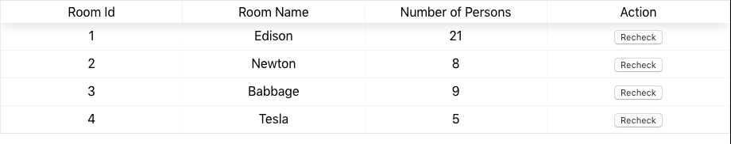
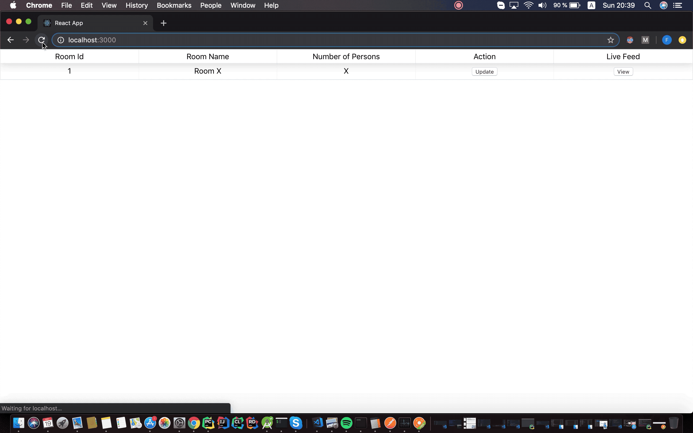

# itsg-alwaysright

itsg-alwaysright created by GitHub Classroom

## Project Teaser:
YouTube: https://youtu.be/5zqJUUvHgUE

GoogleDrive: https://drive.google.com/file/d/18p63rIk9qFITah2mHPFq6Kw2RbQJsWhk/view?usp=sharing

## Project idea:

Room monitoring system used to provide information on the number persons present in the room and the social distancing information.

The application is provided as a web page where the user is provided with a live feed for every room accompanied by statistics such as: number of people,
approximate distance between people.
The web page communicates with a machine learning server via REST and outputs the received prediction. In order to for the machine learning server to receive an image,
it communicates with a raspberry PI server that captures the image upon request.

## Slave (PIServer)

The PI server is used in order to retrieve screenshots from a particular room.
The images are used by the machine learning model in order to make a prediction regarding the number of persons in the room.

## Master (Machine learning model)

The master server responds to the rest request from the client, returning the number of persons for each available room.
An example of response from the master server is as follows:

```
{
    "rooms": [
        {
            "num_persons": 1,
            "room_name": "Room #1",
	    "image": "base64 string"
        }
    ]
}
```

## Client

The client is provided as a web page created using React and displays the number of persons for each available room and the social distancing informatio.
The user can also view a 'live feed' of the model's bounding box detections by accessing the 'view feed' functionality.



## Build and install

# PIServer

On Android Studio, click on the "Run" button.

If you prefer to run on the command line, type

```bash
./gradlew installDebug
adb shell am start ro.ubbcluj.cs.tamasf.roomspy/.MainActivity
```


If you have everything set up correctly, the server should be sending data to the client.

# Machine learning server

First make sure that all of the necessary dependencies are installed by running the following command:

```
pip install -r requirements.txt
```

Since the server is dependent on the machine learning model we first need to retrieve it using the helper script:

```
chmod +x get_yolo.sh
./get_yolo.sh
```

Now we can start the server by running the following command:

```
python3 server.py
```

The server should now be running and handling requests from the client.

# Client

Install all the necessary packages:

```
npm install
```

Run the project:

```
npm start
```

# Demo

